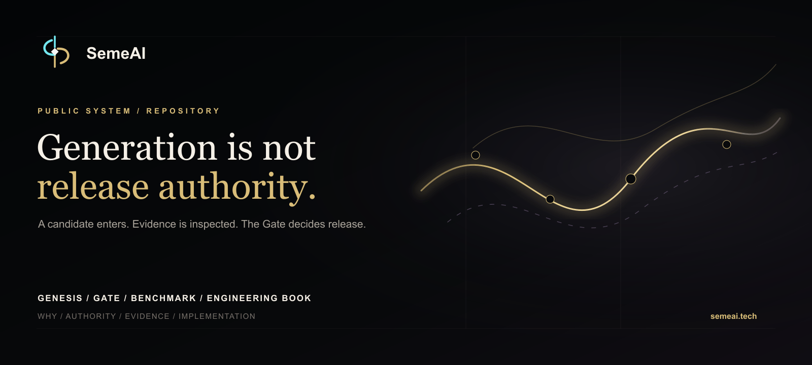
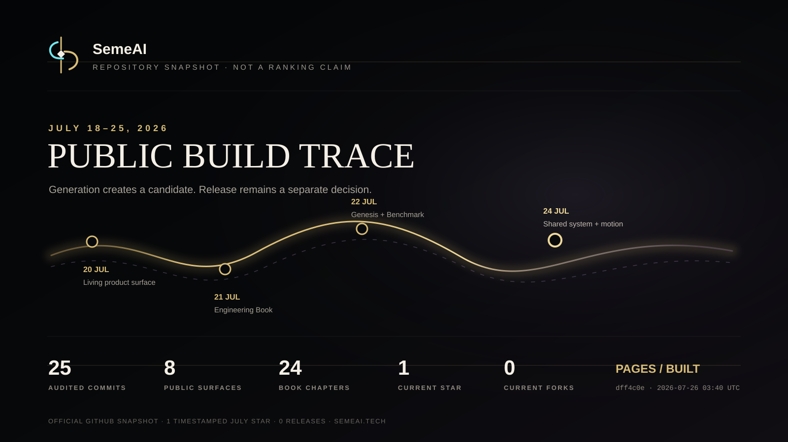
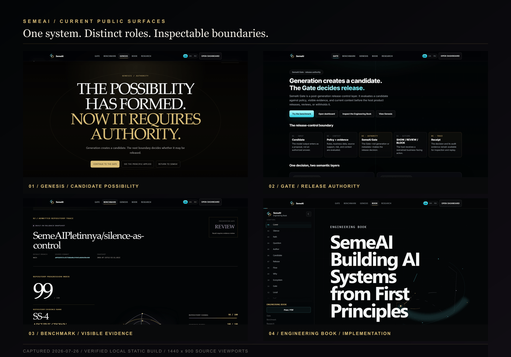
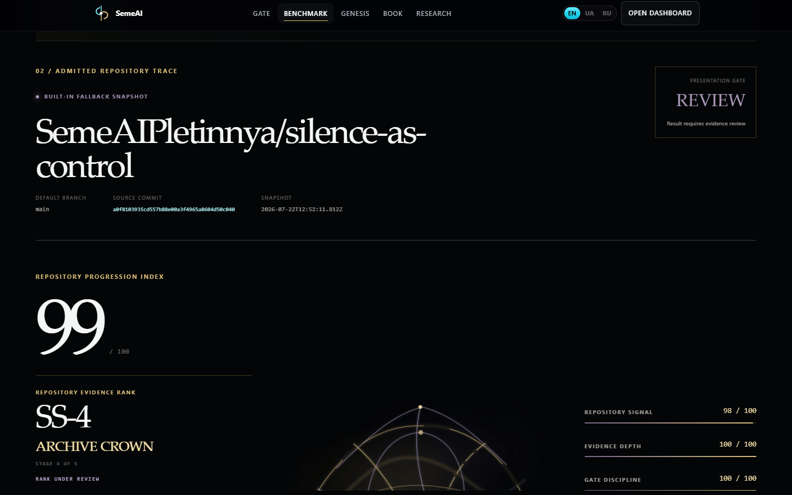

<p align="center">
  
</p>

# SemeAI

**Generation is not release authority.**

SemeAI separates an AI-generated candidate from the decision to release it. The public site presents one connected system: Genesis establishes the premise, the Gate holds release authority, the Repository Evidence Benchmark inspects bounded visible evidence, and the Engineering Book records the architecture and its limits.

[Open SemeAI](https://semeai.tech/) · [Enter Workspace](https://semeai.tech/account/) · [Run the Repository Benchmark](https://semeai.tech/benchmark/) · [Enter Genesis](https://semeai.tech/genesis/) · [Inspect the Gate](https://semeai.tech/gate.html) · [Read the Engineering Book](https://semeai.tech/book/) · [Review Skill Forge evidence](https://semeai.tech/skills/)

## One system, distinct authorities

> Genesis sets the universe.<br>
> The site uses its language.<br>
> The product uses its rules.

| Surface | System role | Authority boundary |
| --- | --- | --- |
| [Genesis](https://semeai.tech/genesis/) | Why the system exists; candidate possibility enters the system | Generation creates a candidate, not a released answer |
| [Gate](https://semeai.tech/gate.html) | Post-generation release authority | Canonical states remain `PROCEED`, `NEEDS_REVIEW`, and `SILENCE` |
| [Repository Evidence Benchmark](https://semeai.tech/benchmark/) | Anonymous instrument for bounded visible repository evidence | Its display-only Presentation Gate is not SaC/PoR runtime release authority |
| [Engineering Book](https://semeai.tech/book/) | Architecture, implementation thinking, evidence, continuity, and limits | A 24-chapter inspectable publication, not a second runtime |
| [Research](https://semeai.tech/research.html) | Public artifacts, active inquiry, and claim boundaries | Retrieval and repository history are evidence sources, not truth or certification |
| [Account / Workspace](https://semeai.tech/account/) | Identity, access, and one governed context through the current account API | Workspace access is not release authority; unavailable persistence surfaces are labeled |
| [Skill Forge](https://semeai.tech/skills/) | Candidate-method evidence and registry review | Candidate generation and registry presence are not skill admission |
| [Dashboard](https://semeai.tech/dashboard.html) | API-backed operational surface | Candidate, release decision, and receipt remain separate artifacts |

Generation creates a candidate. Release is a separate decision.

## July 18–25, 2026 — Build Trace

The audited range contains 25 commits, made from July 20 through July 24. It changed 82 files with 19,960 additions and 1,256 deletions.

- **July 20 · Public site** — the root experience became a living release-control composition with a candidate-to-decision spine, evidence surface, and responsive ecosystem map ([range start `f1b00aa`](https://github.com/SemeAIPletinnya/semeai.tech/commit/f1b00aa4243168b72fa18ece908e014748dc0a36)).
- **July 21 · Engineering Book** — the first 24-chapter technical publication and its maintenance workflow were added ([`57fbd55`](https://github.com/SemeAIPletinnya/semeai.tech/commit/57fbd5501a37fe4b53870c5616d01d97add91797)).
- **July 22 · Genesis** — nine cinematic scenes established the origin narrative and its transition toward release authority ([`38f7bab`](https://github.com/SemeAIPletinnya/semeai.tech/commit/38f7bab01ffe8cd216964f8a44bdaa1e1da218c8)).
- **July 22 · Benchmark** — the anonymous Repository Evidence Benchmark introduced bounded public collection, fixed scoring, a Presentation Gate, and a local receipt ([`d21bb78`](https://github.com/SemeAIPletinnya/semeai.tech/commit/d21bb7840eb50b2e5e04b7aa5e5614faf57b53f7)).
- **July 24 · Shared system** — common brand, navigation, product surfaces, and EN/UK/RU architecture copy connected the routes ([`04037ce`](https://github.com/SemeAIPletinnya/semeai.tech/commit/04037ce7ab10c3e11f0edb61011aeef285ab3675), [`d13efff`](https://github.com/SemeAIPletinnya/semeai.tech/commit/d13efff25c758d96e2731da897e4ea7bf3a02a79)).
- **July 24 · Evidence artifact** — the Benchmark gained its deterministic evidence-rank surface and restrained ambient response without changing the analytical role of the result ([`95c678e`](https://github.com/SemeAIPletinnya/semeai.tech/commit/95c678e05a0977bd8dee81a51626c4bc264393e8)–[`520ff27`](https://github.com/SemeAIPletinnya/semeai.tech/commit/520ff27619cc6f8972d4774ac55a81d72fee06f5)).
- **July 24 · Publication and motion** — the Book reader and Genesis motion were refined into their current public shells ([`d1c28b0`](https://github.com/SemeAIPletinnya/semeai.tech/commit/d1c28b0b4c2b7e1d98d796b3918d037b7bfa2f5f), [`dff4c0e`](https://github.com/SemeAIPletinnya/semeai.tech/commit/dff4c0e4bdbd05a0544c51689a90638e9c35ab13)).

[Read the detailed audited build trace](./docs/updates/2026-07-18-to-2026-07-25.md).

<p align="center">
  
</p>

Public-signal snapshot captured from the official GitHub API on **2026-07-26 at 03:40 UTC**: **1 star**, **0 forks**, **0 releases**. The official stargazer timestamp records one July star; this is a point-in-time repository snapshot, not a ranking claim.

## Current public surfaces

<p align="center">
  
</p>

The visual system uses near-black controlled space, warm gold for authority and admitted evidence, restrained violet for depth, and cyan only as a brand or active-runtime accent. Shared navigation and EN/UK/RU language controls connect the primary routes while preserving their different roles.

## Repository Evidence Benchmark

The public Benchmark measures visible repository signals in seven fixed categories:

1. implementation evidence;
2. tests and reproducibility;
3. evidence and receipts;
4. continuity and replay;
5. release-control discipline;
6. research and documentation;
7. external public signal.

It does **not** measure AGI probability, human intelligence, personal worth, universal repository quality, security certification, or production readiness.

<p align="center">
  
</p>

Screenshot context: captured **2026-07-26** from the verified local public route for `SemeAIPletinnya/silence-as-control`, using **BUILT-IN FALLBACK SNAPSHOT** at source commit `a0f8103935cd557b88e00a3f4965a8604d50c040`, analyzer `1.0.0`, and policy `semeai.repository-evidence.score.v1`. Its score of 99 and `REVIEW` decision belong only to that frozen fixture. Results can change with the admitted repository snapshot; one result is not universal validation of the instrument.

The Benchmark remains available anonymously. GitHub account connection is currently withheld in the public interface rather than linking to an unavailable endpoint.

The isolated Repository Workspace surface exists at [`/benchmark/workspace/`](https://semeai.tech/benchmark/workspace/) but keeps GitHub actions disabled until the backend reports real GitHub App and canonical-analyzer configuration. Local backend implementation is not represented as production authentication.

## Product and evidence spine

Account answers who the current user is and which single governed workspace the current API returns. Workspace presents real account, usage, billing, decision, receipt, and bounded skill-candidate evidence data; conversations, sources, memory, and general evidence remain explicitly unconnected when no persistence endpoint exists. Dashboard remains the operator Gate console.

Genesis includes a data-driven Chronicle for significant public, verified system changes. Skill Forge exposes GET JOB and GET VIS as `REVIEW` candidates with nine bounded case records in total and zero admitted skills. Authenticated workspaces may retain immutable candidate-evidence snapshots, but retention is not admission. No installable skill or operating marketplace is claimed.

Implementation and authority boundaries are documented in:

- [`docs/system-architecture.md`](./docs/system-architecture.md);
- [`docs/runtime_decision_contract.md`](./docs/runtime_decision_contract.md);
- [`docs/review_release_receipt_layer.md`](./docs/review_release_receipt_layer.md);
- [`docs/skill-forge-boundary.md`](./docs/skill-forge-boundary.md).

## Engineering Book

The [SemeAI Engineering Book](https://semeai.tech/book/) contains 24 chapters by **Anton Semenenko, Independent AI Systems Engineer**. It follows the system from candidate generation through release authority, Gate decisions, evidence, receipts, replay, runtime structure, limitations, and future design.

The editable source is [`assets/js/book-content.js`](./assets/js/book-content.js). Navigation and print/PDF maintenance are documented in [`docs/engineering_book_maintenance.md`](./docs/engineering_book_maintenance.md).

## Find the right surface

| Intent | Surface |
| --- | --- |
| Understand why release authority is separate | [Genesis](https://semeai.tech/genesis/) |
| Inspect the decision boundary | [Gate](https://semeai.tech/gate.html) |
| Test a public repository | [Benchmark](https://semeai.tech/benchmark/) |
| Study implementation principles | [Engineering Book](https://semeai.tech/book/) |
| Review evidence and limitations | [Research](https://semeai.tech/research.html) |
| Enter identity and governed context | [Account](https://semeai.tech/account/) → [Workspace](https://semeai.tech/workspace/) |
| Use the API-backed operator surface | [Dashboard](https://semeai.tech/dashboard.html) |
| Inspect skill-candidate evidence | [Skill Forge](https://semeai.tech/skills/) |

## Repository and deployment

This repository is the public static site. It depends on two distinct neighboring projects:

- [`SemeAIPletinnya/semeai-gate-basic`](https://github.com/SemeAIPletinnya/semeai-gate-basic) — the adapter and API surface used by the operational site;
- [`SemeAIPletinnya/silence-as-control`](https://github.com/SemeAIPletinnya/silence-as-control) — governance source context and the canonical public Benchmark fixture.

GitHub Pages deploys `master` through [`.github/workflows/pages.yml`](./.github/workflows/pages.yml). The latest deployment inside the July audit completed successfully for `dff4c0e`.

Local static preview:

```bash
python -m http.server 8000
```

Then open `http://localhost:8000/`. The locked browser contract requires Node.js 20 or later:

```bash
npm ci
npx playwright install chromium
npm test
```

The same suites run through [`.github/workflows/ci.yml`](./.github/workflows/ci.yml). GitHub Pages deployment remains independent in [`.github/workflows/pages.yml`](./.github/workflows/pages.yml).

## Claim boundary

SemeAI is a working public and local prototype of release-control architecture.

It is not a foundation model, AGI, an autonomous company, a universal safety layer, a universal hallucination detector, a compliance certification, or proof of production security. A commit is implementation evidence, not proof of idea origin. Retrieval is not truth. The Benchmark Presentation Gate controls only whether a benchmark result is displayed; SaC/PoR remains the runtime release authority.

## Author and project status

**Anton Semenenko** — Independent AI Systems Engineer; founder and builder of SemeAI.

Current work is an inspectable engineering and research direction. Public artifacts, deterministic fixtures, tests, receipts, and deployed surfaces document what exists; they do not substitute for independent validation.
